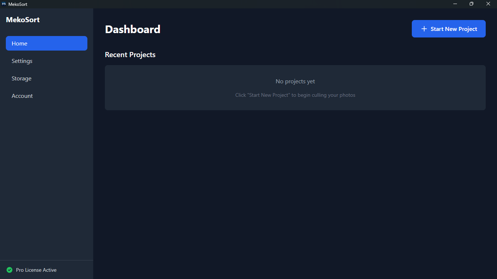

# MekoSort 🚀

_[Read in English](#-english-version)_

**Mesin Culling & Sortir Foto Ultra-Cepat.**



MekoSort adalah aplikasi desktop profesional yang dirancang untuk mengatasi hambatan terbesar dalam alur kerja (workflow) seorang fotografer: menyortir ribuan file foto berukuran raksasa. Dibangun dengan fokus mutlak pada kecepatan dan pengalaman pengguna tanpa lag.

Diciptakan oleh **Meko no Mori** - UI/UX & Software Agency.

## 📥 Download & Instalasi

1. Buka tab [Releases](../../releases).
2. Unduh `MekoSort Setup 1.0.0.exe`.
3. Jalankan installer dan mulai sortir foto Anda secara instan.
   _(Catatan: Windows SmartScreen mungkin menampilkan peringatan "Unknown Publisher" untuk developer indie. Klik "More Info" -> "Run Anyway")._

---

## 🛠️ Di Balik Layar (Arsitektur & Rekayasa)

_Untuk Tech Leads dan Developer._

Membangun aplikasi desktop yang mampu menangani **6.000+ gambar resolusi tinggi** secara bersamaan tanpa crash membutuhkan manajemen memori yang ketat dan arsitektur yang sangat dioptimalkan.

**Tech Stack:** `Electron` | `React` | `TypeScript` | `Vite` | `TailwindCSS` | `Better-SQLite3`

### Tantangan Rekayasa Utama yang Diselesaikan:

1. **Zero-Lag Infinite Scroll:** Mengimplementasikan DOM virtualization di React untuk merender hanya foto yang terlihat di layar, mencegah kebocoran memori (memory leaks) dan mempertahankan scrolling 60fps bahkan pada direktori raksasa.
2. **State Persistence:** Mengintegrasikan `Better-SQLite3` langsung ke dalam Electron Main Process. Setiap proses cull, pelabelan, dan perubahan kategori langsung disinkronkan ke file `.db` lokal. Jika aplikasi crash atau PC mati tiba-tiba, progres tidak ada yang hilang.
3. **Non-Destructive OS Operations:** Memanfaatkan modul `fs` dari Node.js untuk pemindahan file secepat kilat, mengeksekusi transfer file fisik hanya ketika pengguna secara sadar menekan tombol "Execute".
4. **Keyboard-First Navigation:** Mengoptimalkan event listeners untuk culling tanpa mouse yang mulus menggunakan Tombol Panah (Navigasi) dan Numpad `[1-5]` (Kategorisasi).

### Cuplikan Kode: Safe Execution Engine

_(Sekilas tentang bagaimana MekoSort merutekan file dengan aman di tingkat OS)_

```typescript
// Konsep abstrak dari Eksekusi Culling
async function executeCull(projectId, photoList) {
  try {
    db.transaction(() => {
      photoList.forEach((photo) => {
        if (photo.status === "APPROVED") {
          fs.renameSync(photo.sourcePath, photo.targetPath);
          db.updateStatus(photo.id, "MOVED");
        }
      });
    })();
  } catch (error) {
    logger.error("Eksekusi dihentikan untuk mencegah kehilangan data", error);
  }
}
```

### 📄 Lisensi

© 2026 Meko no Mori. Hak cipta dilindungi undang-undang. Ini adalah produk komersial berpemilik. Source code bersifat tertutup (private).

---

## 🇬🇧 English Version

**Lightning-fast Photo Culling & Sorting Engine.**

MekoSort is a professional desktop application engineered to solve the biggest bottleneck in a photographer's workflow: sorting through thousands of massive photo files. Built with a focus on absolute speed and zero-lag user experience.

Crafted by **Meko no Mori** - UI/UX & Software Agency.

## 📥 Download & Installation

1. Go to the [Releases](../../releases) tab.
2. Download `MekoSort Setup 1.0.0.exe`.
3. Run the installer and start sorting your photos instantly.
   _(Note: Windows SmartScreen might show an "Unknown Publisher" warning for indie developers. Click "More Info" -> "Run Anyway")._

---

## 🛠️ Under the Hood (Architecture & Engineering)

_For Tech Leads and Developers._

Building a desktop app that handles **6,000+ high-resolution images** simultaneously without crashing requires strict memory management and an optimized architecture.

**Tech Stack:** `Electron` | `React` | `TypeScript` | `Vite` | `TailwindCSS` | `Better-SQLite3`

### Key Engineering Challenges Solved:

1. **Zero-Lag Infinite Scroll:** Implemented DOM virtualization in React to render only the visible photos, preventing memory leaks and maintaining 60fps scrolling even with massive directories.
2. **State Persistence:** Integrated `Better-SQLite3` directly into the Electron Main Process. Every cull, label, and category change is immediately synced to a local `.db` file. If the app crashes or the PC shuts down, zero progress is lost.
3. **Non-Destructive OS Operations:** Leveraged Node.js `fs` module for lightning-fast file movements, executing physical file transfers only when the user explicitly hits "Execute".
4. **Keyboard-First Navigation:** Optimized event listeners for seamless, mouse-free culling using Arrow Keys (Navigation) and Numpad `[1-5]` (Categorization).

### Code Snippet: Safe Execution Engine

_(A glimpse into how MekoSort safely routes files at the OS level)_

```typescript
// Abstracted concept of the Culling Execution
async function executeCull(projectId, photoList) {
  try {
    db.transaction(() => {
      photoList.forEach((photo) => {
        if (photo.status === "APPROVED") {
          fs.renameSync(photo.sourcePath, photo.targetPath);
          db.updateStatus(photo.id, "MOVED");
        }
      });
    })();
  } catch (error) {
    logger.error("Execution halted to prevent data loss", error);
  }
}
```

### 📄 License

© 2026 Meko no Mori. All rights reserved. This is a proprietary commercial product. The source code is private.
