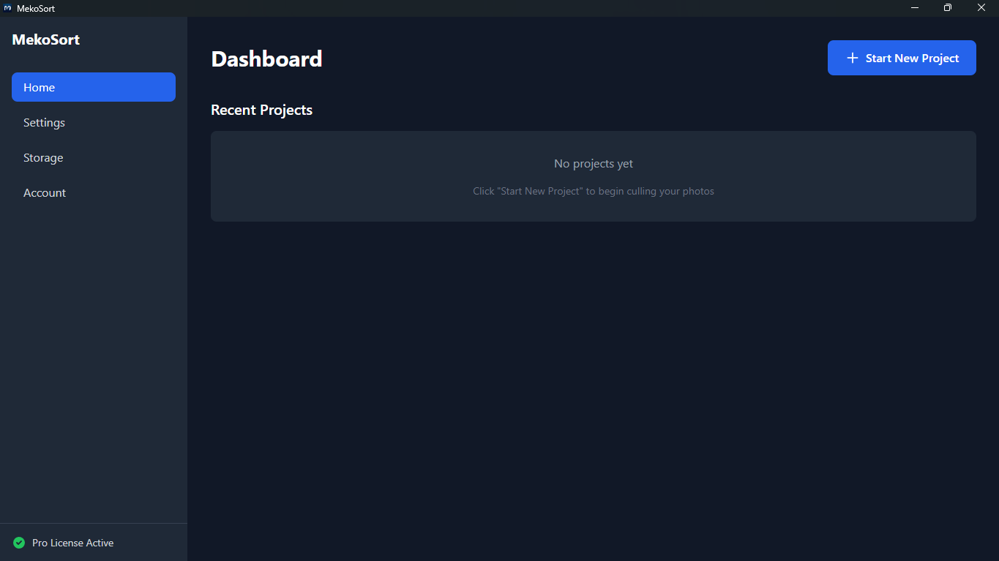

# MekoSort v2.0.0 🚀

**The Ultimate Lightning-Fast Photo Culling & Sorting Engine.**



MekoSort v2.0.0 adalah evolusi total. Kami meninggalkan Electron dan membangun ulang inti aplikasi menggunakan **Rust** untuk kecepatan yang tidak tertandingi. Dirancang khusus untuk fotografer profesional yang menangani ribuan file RAW tanpa kompromi pada performa.

Diciptakan oleh **Meko no Mori** - UI/UX & Software Agency.

## 📥 Download v2.0.0 (Official Release)

1. Kunjungi [Website Resmi MekoSort](https://meko-sort-web.vercel.app/) untuk Live Counter.
2. Atau langsung ke tab [Releases](../../releases).
3. Unduh `MekoSort_v2.0.0_x64_en-US.msi`.

---

## 🛠️ Engineering Excellence (v2.0.0 Rewrite)

_Architecture update for Tech Leads and Software Engineers._

Versi 2.0.0 menandai transisi kami ke arsitektur **Tauri**, memindahkan beban kerja berat dari JavaScript ke **Rust Layer**.

**Tech Stack:** `Tauri (Rust Core)` | `React` | `TypeScript` | `Vite` | `TailwindCSS` | `Supabase`

### Key Engineering Upgrades:

1. **Rust-Powered Culling:** Pemrosesan metadata file RAW kini dilakukan di level sistem melalui Rust, menghilangkan bottleneck I/O yang ada di versi sebelumnya.
2. **Memory Efficiency:** Dengan Tauri, footprint memori aplikasi berkurang hingga 80% dibandingkan versi Electron.
3. **Hidden ExifTool Integration:** Eksekusi `exiftool` dilakukan secara *background silent process* (No CMD Spam) menggunakan `creation_flags` pada Windows.
4. **Live Statistics:** Integrasi Supabase RPC untuk melacak metrik adopsi pengguna secara real-time.

### Code Snippet: The Rust Advantage

```rust
// Bagaimana kami menangani file secara instan dan aman di layer Rust
#[tauri::command]
fn execute_sort(files: Vec<Photo
